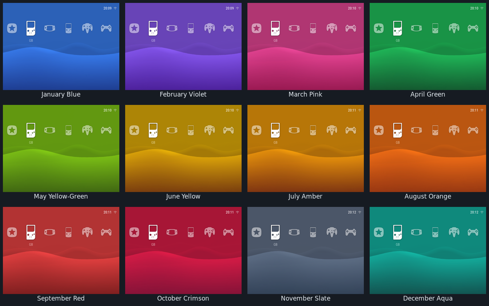
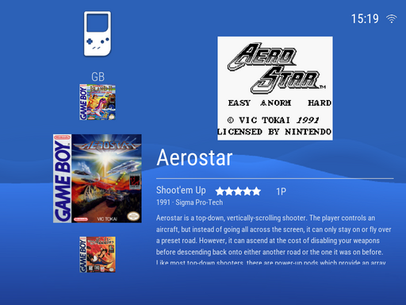
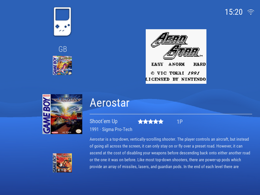
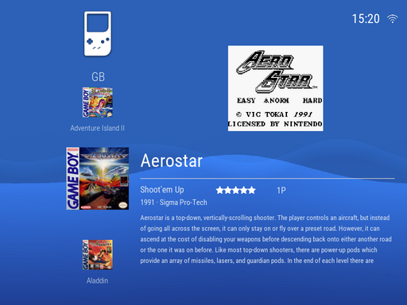

# es-theme-xmb-psp

A PSP XMB theme for [batocera-emulationstation](https://github.com/batocera-linux/batocera-emulationstation) — built and tuned for **Knulli on the TrimUI Brick** (4:3, 1024×768).

The XMB cross, a continuously animated wave, twelve PSP-month colorsets, three
gamelist layouts and dedicated icons for 170+ systems. Five tuned aspect ratios,
a themed boot splash, navigation sounds and a colorset-themed ES menu. Current
version and release history are in [CHANGELOG.md](CHANGELOG.md).

## Install

No SSH, no git — download an archive and drop one folder on the SD card.

1. **Download the theme.** On this repo's page use **Code ▸ Download ZIP**, or take
   a direct link:
   [`main.zip`](https://github.com/barretstorck/es-theme-xmb-psp/archive/refs/heads/main.zip)
   · [`main.tar.gz`](https://github.com/barretstorck/es-theme-xmb-psp/archive/refs/heads/main.tar.gz)
2. **Power the device off** and put its SD card in your computer. Knulli's data
   partition is labelled **`SHARE`** — that's `/userdata` on the device.
3. **Extract the archive.** It unpacks to a folder named `es-theme-xmb-psp-main`
   (GitHub appends the branch name). **Rename it to `es-theme-xmb-psp`.** It is
   about 3 MB — the archive is trimmed to the theme payload ES actually loads,
   so the docs, scripts and test harness in this repo don't land on your card.
4. **Move that folder into `SHARE/themes/`**, creating `themes` if it isn't there.
   When you're done the card should contain `SHARE/themes/es-theme-xmb-psp/theme.xml`.
5. Eject the card safely, put it back in the device and boot.
6. In EmulationStation: **Main Menu ▸ UI Settings ▸ Theme Set ▸ `es-theme-xmb-psp`**.
7. **Main Menu ▸ Quit ▸ Restart Emulation Station.**

> **`SHARE` doesn't show up on your computer?** Some cards format that partition as
> ext4, which Windows and macOS can't read without extra software. Copy the folder
> over the network instead — Knulli runs a Samba share by default, so browse to
> `\\<device-ip>\share` (or `\\KNULLI\share`) with the device powered on and drop
> the renamed folder into its `themes` directory.

If the theme leaves ES unable to start, see
[docs/troubleshooting.md](docs/troubleshooting.md) for the command that forces the
device back to the built-in `carbon` theme.

## Colorsets

Twelve PSP-month palettes, picked in **UI Settings ▸ Theme Configuration ▸ PSP
Color**. Each one retints the wave, the icons, the captions, the ES menu and the
boot splash together.

Left to right, top to bottom: January Blue (the default), February Violet,
March Pink, April Green, May Yellow-Green, June Yellow, July Amber, August
Orange, September Red, October Crimson, November Slate, December Aqua.

## Gamelist styles

Three layouts, in **UI Settings ▸ Theme Configuration ▸ Gamelist Style**.

| PSP Card (default) | List + Details | Box Art Grid |
|:---:|:---:|:---:|
|  |  |  |
| Each game is a collapsed row that expands into a card with box art, a screenshot that becomes a preview video, and a bounded description. | A ten-row title list with art, metadata and description. | A wall of cover art with an info bar. Selection is shown by enlarging the cover — no highlight box, no dimming. |

**Box Art Grid needs UI Settings ▸ Gamelist View Style = Automatic** (ES's own
default, in a different menu). Pinned to Detailed or Gamecarousel, ES ignores the
theme's requested view and renders an unstyled gamelist instead. The theme can't
detect or override that.

In PSP Card and List + Details the screenshot becomes a video preview after
**Video Delay**. Whether that slot shows a real screenshot or a second copy of the
box art is down to your scraper: it reads the game's `<image>` tag, which most
scrapers fill separately from `<thumbnail>`.

## Settings

All under **Main Menu ▸ UI Settings ▸ Theme Configuration**. Defaults are listed
first.

| Setting | Values | What it does |
|---|---|---|
| **PSP Color** | January Blue … December Aqua | Colorset — see above |
| **Gamelist Style** | PSP Card · List + Details · Box Art Grid | Gamelist layout — see above |
| **Icon Size** | Boxart · Compact | PSP Card row icons: scraped box art, or small uniform thumbnails |
| **Title Visibility** | PSP-Faithful · With Titles | Whether unselected PSP Card rows show a title beside the icon |
| **Video Delay** | 5 seconds · Instant · 2 seconds · 10 seconds | How long a game stays selected before its screenshot becomes a preview video |
| **Video Audio** | Off · On | Audio on that preview video (also gated by ES's own *Enable video preview audio*) |
| **Scroll Speed** | Normal · Slow · Fast | How fast a long description scrolls. No effect in Box Art Grid, which shows a caption rather than a description |
| **Game Count** | Hide · Show | Whether the system caption also cycles to an "X GAMES" counter |
| **Button Icons** | Nintendo · PSP · Xbox | Face-button glyphs in the help strip — see below |

Two things this theme deliberately does **not** put a knob on:

- **The wave animation** is always on. There is no opt-out and no per-system or
  per-device override.
- **The battery readout** follows *UI Settings ▸ Show Battery Status* — `NO` hides
  it, `ICON` shows the glyph, `ICON AND TEXT` (the ES default) shows glyph and
  percentage. The status bar re-packs itself around whatever is showing, so a
  device with no battery, a hidden clock or no network connection just gets a
  shorter cluster still flush to the right margin. The network glyph is ES's
  binary connected/not-connected indicator redrawn in the theme's style; a
  PSP-style 4-bar signal strength isn't available to themes at all.

### Icon Size and Title Visibility

|  | **PSP-Faithful** (default) | **With Titles** |
|:---:|:---:|:---:|
| **Boxart** (default) |  |  |
| **Compact** |  |  |

### Button Icons

| | east / south / north / west |
|---|---|
| **Nintendo** (default) | A · B · X · Y |
| **PSP** | ○ Circle · ✕ Cross · △ Triangle · □ Square |
| **Xbox** | B · A · Y · X |

Nintendo is the default because the Brick silkscreens its buttons that way — a
help strip reading "✕ Enter" tells a Brick owner nothing. Each glyph is pinned to
a physical button position rather than to a label, so the setting stays correct
whichever way **Menu ▸ Invert Buttons** is set. D-pad, shoulder, START and SELECT
glyphs are shared by all three sets. Glyphs are monochrome and colorset-tinted, so
Xbox's four-colour coding isn't reproduced — ES multiplies help icons by the
theme's icon colour, which can't preserve four hues.

### Navigation sounds

A **tick** on every selection move in any view, a **confirm** on launching a game
or opening a gamelist menu, and a **back** sound when leaving a subfolder.

**You will hear none of them until you turn navigation sounds on** — that's ES's
own switch, not a theme option, and it ships off: **Main Menu ▸ Sound Settings ▸
Enable Navigation Sounds**. ES doesn't reload sound files it skipped while the
setting was off, so restart EmulationStation after enabling it.

## Screenshots

### System view and gamelist, per aspect ratio

| | System view | Gamelist |
|---|:---:|:---:|
| **4:3** (1024×768) |  |  |
| **16:9** (1280×720) |  |  |
| **3:2** (720×480) |  |  |
| **1:1** (720×720) |  |  |
| **8:7** (1024×896) |  |  |

### Boot splash

Shown for the whole of EmulationStation's boot, tinted by the selected colorset.
The mark is the theme's own — there is no Sony wordmark anywhere in this repo.

| 4:3 — January Blue | 4:3 — August Orange | 1:1 — December Aqua |
|:---:|:---:|:---:|
|  |  |  |

## How the wave is built

The PSP XMB wave is rendered entirely by ES storyboard property animation over
static PNGs — no video and no animated GIF, since animated images aren't supported
in this ES build:

- A flat, dark, colorset-tinted `wave.png` provides the canvas.
- Three transparency-channel PNGs (`wave-layer-{1,2,3}.png`) stack on top, each
  with a sine-shaped opaque-to-transparent boundary at a different vertical
  position. Tinted with `${accent}`, each reads as a bright wave band.
- Each layer is 2× screen width and horizontally seamless (integer cycles per
  screen width), scrolling left at its own rate — 30s, 20s and 12s per full cycle.
  The seamless wrap makes the storyboard's repeat visually invisible.
- A pure-white 4-pixel rim highlight along each wave's upper edge makes the crest
  pop against the body.

The layers are generated procedurally by a small Python script and sized
2048×1080, so the design scales cleanly past the 1024×768 Brick it was built on.
The animation runs continuously and does not reset when you move along the system
carousel.

## Compatibility

- **Verified on-device:** Knulli Scarab on TrimUI Brick (4:3, 1024×768).
- **Verified in the Docker render harness:** 4:3, 16:9, 3:2, 1:1 and 8:7.
- **Likely fine:** any Batocera/Knulli device whose screen falls into one of those
  ratios at any resolution, running batocera-emulationstation with `formatVersion 7`.
- **Other ratios** (21:9, 5:4, vertical…) silently fall back to the 4:3 layout, and
  may letterbox or stretch.
- **Not verified:** ES-DE and other EmulationStation forks — they parse a different
  dialect and are known to ignore or mis-render parts of this one. Tracked in
  [#46](https://github.com/barretstorck/es-theme-xmb-psp/issues/46); reports welcome.

## Known limitations

- **Icon coverage is mixed-source.** Of the 201 icons in `art/system-icons/`, 150
  come from the RetroArch `monochrome` XMB set, 8 ports are hand-authored in the
  same style, 13 uncommon shortnames keep icons from the previous XMB Menu ES-DE
  set, and 30 are the generic `_default.png` placeholder. To add one, drop
  `<system-shortname>.png` into `art/system-icons/` and run it through
  `scripts/apply-shadow.py` **once** — the script isn't idempotent. ES
  auto-collections use an `auto-` prefix (`auto-favorites.png`, `auto-lastplayed.png`).
- **Gamelist rows need scraped box art.** With Icon Size on `Boxart`, a game with no
  scraped `thumbnail` falls back to its system's media-type silhouette (cartridge,
  CD, floppy — see `art/system-media/`). Scrape with box/thumbnail media, or switch
  to `Compact`.

## More

- [Troubleshooting](docs/troubleshooting.md) — recovering a device that won't boot
  into ES, and silent navigation sounds.
- [Development](docs/development.md) — the Docker render harness, audio capture,
  and regenerating this README's screenshots. No handheld required.
- [Contributing](CONTRIBUTING.md) · [Changelog](CHANGELOG.md) · [Credits](CREDITS.md)

## Credits and license

This is a derivative work — see [CREDITS.md](CREDITS.md) for the full attribution
chain. Licensed under **Creative Commons CC-BY-NC-SA 2.0** ([LICENSE](LICENSE)):
share and adapt for non-commercial purposes, credit the upstream authors, and
license derivatives under the same terms.
