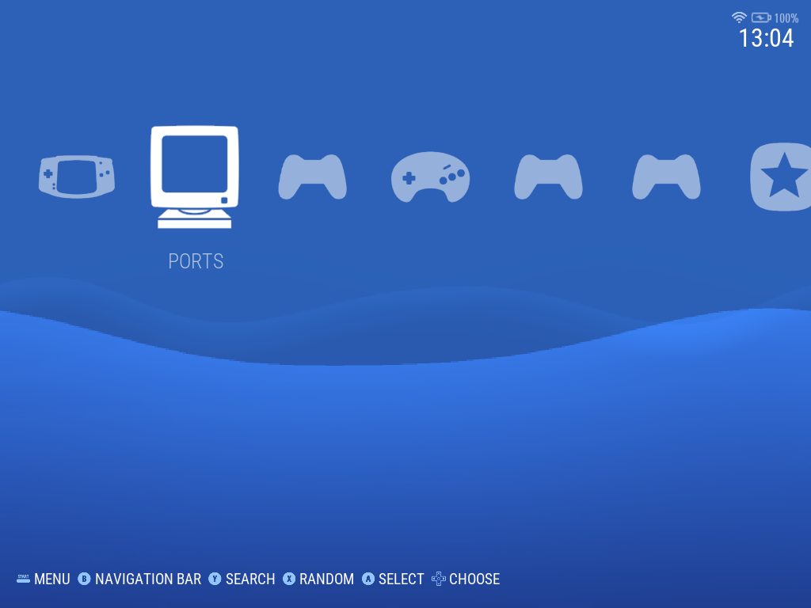
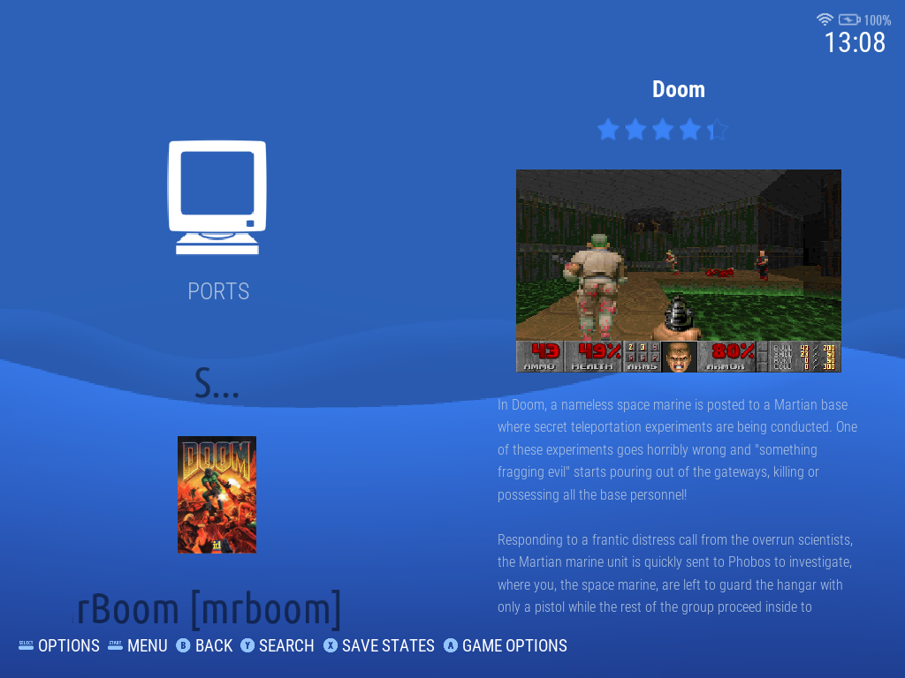

# es-theme-xmb-psp

A PSP XMB-style theme for [batocera-emulationstation](https://github.com/batocera-linux/batocera-emulationstation), built and tuned for **Knulli Scarab on the TrimUI Brick** (4:3, 1024×768).

> Status: **v0.6** — PSP-style variant only. 4:3 only. Twelve user-selectable PSP-month colorsets, always-on PSP XMB wave animation, XMB cross layout (system bar anchored to a square top-left corner, off-center selection, system-name caption), two gamelist styles — text list or boxart carousel — sharing a title / rating / video / description panel, optional game counter, universal system icon coverage. Default colorset is January Blue.




## Known limitations

- **Wave animation resets on every system carousel navigation.** Extra elements in the system view are bound to the carousel scroll in this batocera-emulationstation build; the storyboard restarts at t=0 each time you change systems. Exhaustively verified — no theme-XML workaround exists (screen view, `<image name="background">`, top-level images, fade transition all tried). The motion resumes immediately after.
- Systems without a hand-tuned icon fall back to a generic `_default.png` placeholder. To add a specific icon for any system, drop `<system-shortname>.png` into `art/system-icons/` (this overrides the placeholder automatically on the next sync). Note: ES auto-collections use theme-folder names with an `auto-` prefix (e.g., `auto-allgames.png`, `auto-favorites.png`, `auto-lastplayed.png`) rather than the short collection name.
- The `gamecarousel` gamelist style shows each game's scraped `thumbnail` (box art). A game with no thumbnail scraped falls back to showing its name as a text label. Scrape your library with box/thumbnail media for a full boxart column, or use the `detailed` text-list style.

## Install

1. SSH into your device. The Knulli default credentials are `root` / `linux`:
   ```
   ssh root@<your-device-ip>
   ```
2. Clone (or copy) this repo into `/userdata/themes/`:
   ```
   cd /userdata/themes && git clone <repo-url> es-theme-xmb-psp
   ```
3. In EmulationStation: **Main Menu → UI Settings → Theme Set → `es-theme-xmb-psp`**.
4. (Optional) pick a colorset: **UI Settings → Theme Configuration → PSP Color → choose one**.
5. Restart EmulationStation: **Main Menu → Quit → Restart Emulation Station**.

## Compatibility

- **Tested:** Knulli Scarab on TrimUI Brick (4:3, 1024×768).
- **Likely works:** any Batocera/Knulli device at 4:3 running batocera-emulationstation with `formatVersion 7` support. Other aspect ratios will letterbox or stretch.

## Customization

Three configurable knobs, all under **UI Settings → Theme Configuration**:
- **PSP Color** — colorset (twelve PSP-month palettes; default January Blue)
- **Game Count** — whether the system-name caption stays on the name only (Hide, default) or also cycles to an "X GAMES" counter (Show)
- **Gamelist View Style** — show each system's games as a text list (`detailed`) or as a vertical boxart carousel (`gamecarousel`); `automatic` uses the theme default. Both styles share the same title / rating / video / description info panel.

The wave animation is always on with no opt-out. No per-system or per-device overrides — the theme intentionally ships minimal.

## How the wave is built

The PSP XMB wave is rendered entirely via ES storyboard property animation on static PNGs — no video, no animated GIF (animated images aren't supported in this ES build):

- A flat dark colorset-tinted `wave.png` provides the canvas.
- Three transparency-channel PNGs (`wave-layer-{1,2,3}.png`) are stacked on top, each with a sine-shaped opaque-to-transparent boundary at a different vertical position. Tinted with `${accent}` so each appears as a bright wave band.
- Each layer is 2× screen width with a horizontally-seamless pattern (integer cycles per screen width) and scrolls left at a different rate (30s / 20s / 12s per full cycle). The seamless wrap makes the storyboard repeat visually invisible.
- A pure-white 4-pixel rim highlight at each wave's upper edge makes the crest pop against the body.

The PNGs are generated procedurally by a small Python script (see commit history for `wave-layer-*.png` for parameters). They're sized at 2048×1080 so the design scales cleanly to higher-resolution devices than the 1024×768 Brick this was developed on.

## Troubleshooting

If the theme breaks EmulationStation on startup, SSH still works. To force the device back to the built-in `carbon` theme:

**Knulli:**
```
ssh root@<your-device-ip> "knulli-settings-set theme.set carbon && sed -i 's|<string name=\"ThemeSet\" value=\"[^\"]*\"|<string name=\"ThemeSet\" value=\"carbon\"|' /userdata/system/configs/emulationstation/es_settings.cfg && knulli-es-swissknife --restart"
```

**Batocera:**
```
ssh root@<your-device-ip> 'batocera-settings-set theme.set carbon && batocera-es-swissknife --restart'
```

Knulli stores the theme name in two places (`theme.set` in `knulli.conf` and `ThemeSet` in `es_settings.cfg`) — if they diverge, ES enters a restart loop. The Knulli command above updates both atomically.

## Credits and license

This is a derivative work. See [CREDITS.md](CREDITS.md) for the full attribution chain.

Licensed under **Creative Commons CC-BY-NC-SA 2.0** — see [LICENSE](LICENSE). You may share and adapt this theme for non-commercial purposes, must credit the upstream authors, and must license derivatives under the same terms.
