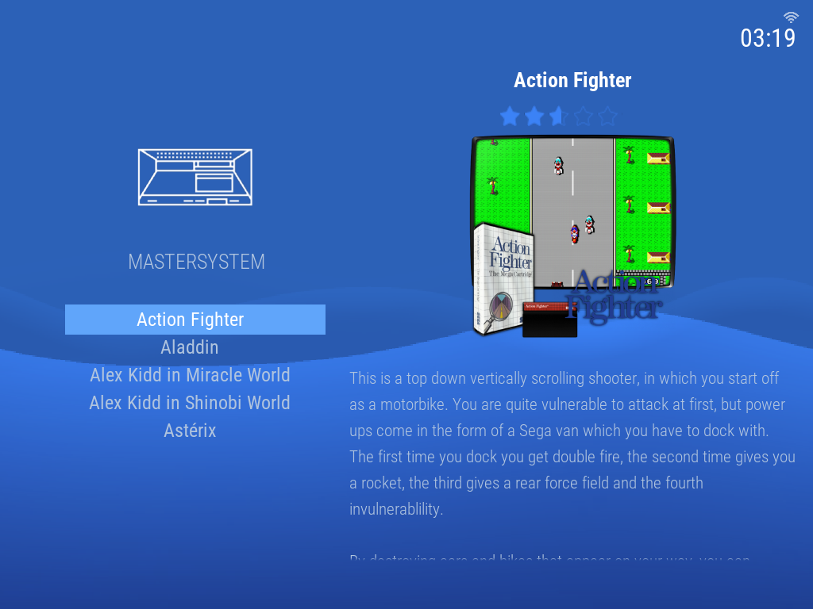
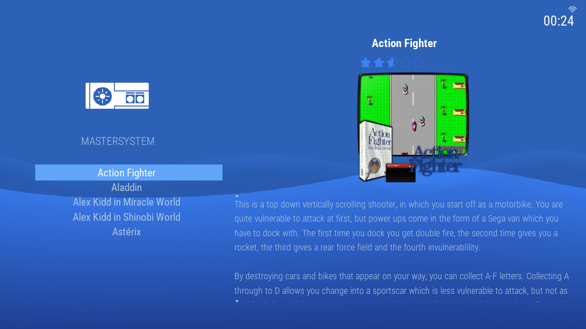
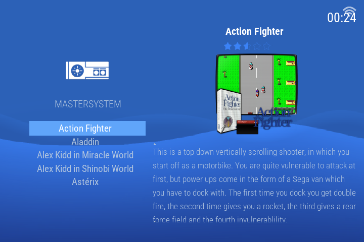
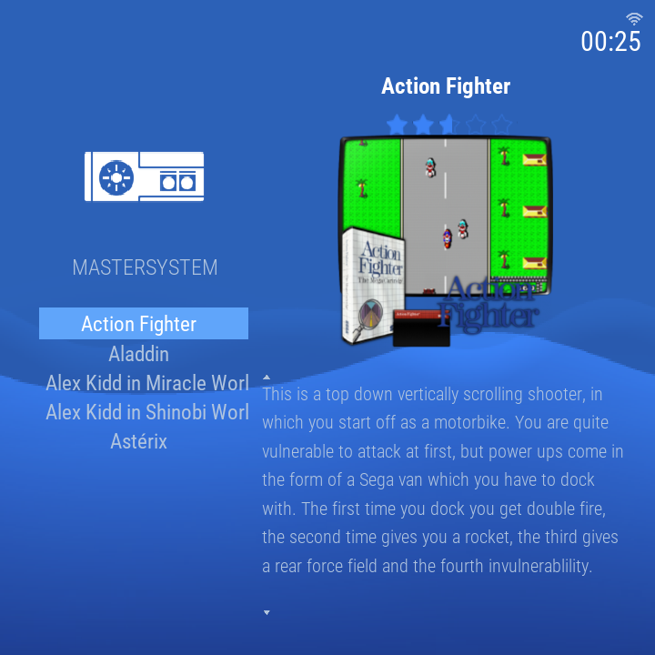
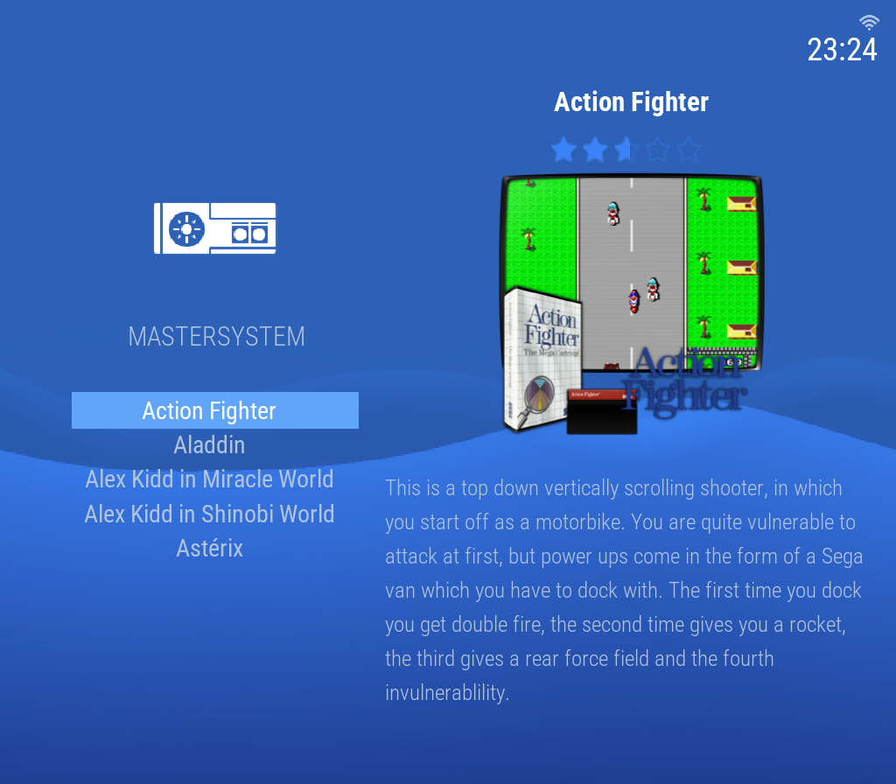
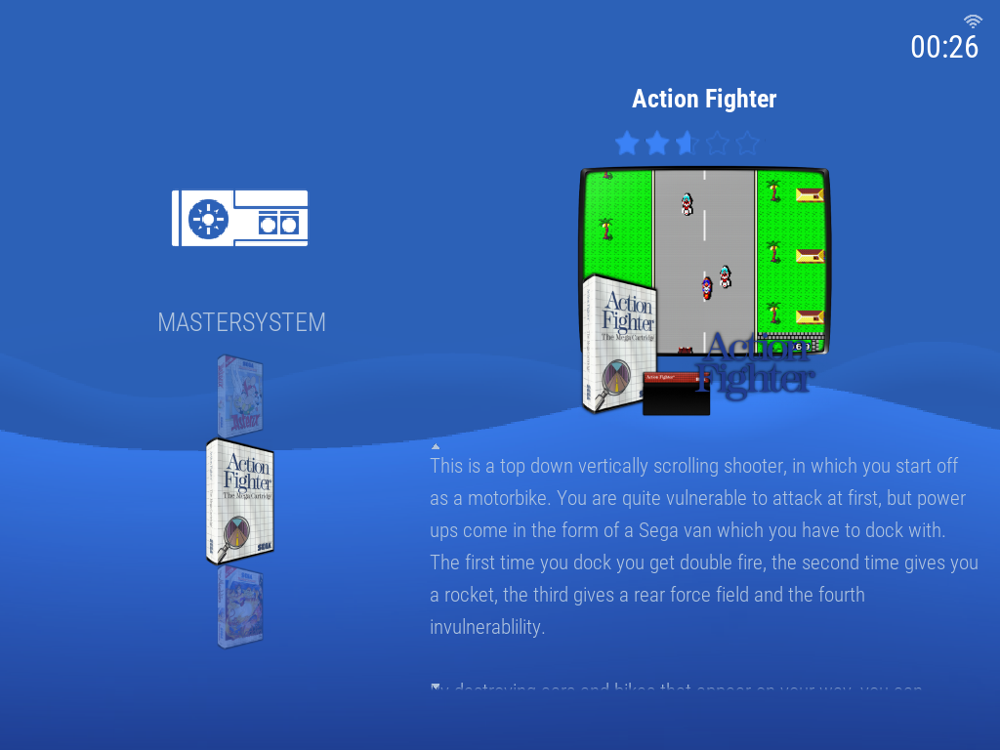
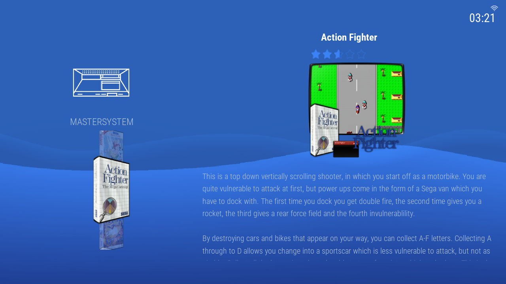
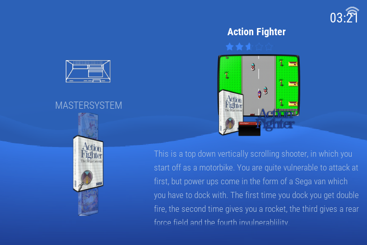
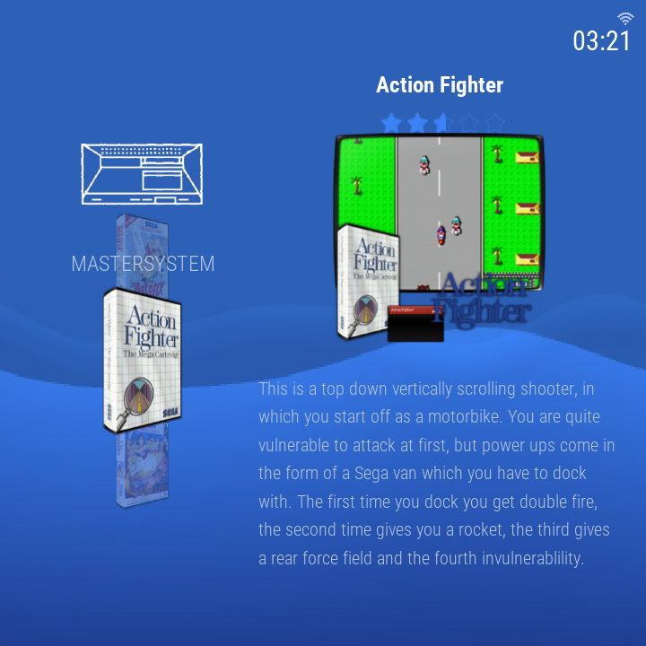
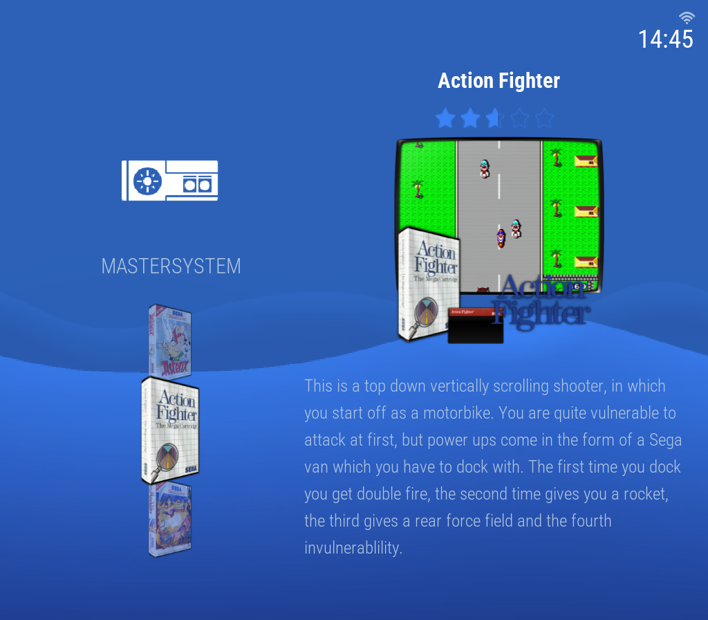

# es-theme-xmb-psp

A PSP XMB-style theme for [batocera-emulationstation](https://github.com/batocera-linux/batocera-emulationstation), built and tuned for **Knulli Scarab on the TrimUI Brick** (4:3, 1024×768).

> Status: **v0.11** — PSP-style variant only. **System icons now adapted from the RetroArch `automatic` XMB icon set** (~75% drop-in coverage; the remaining ~40 less-common shortnames retain the pre-v0.11 Knulli-derived icons, producing a mixed style on a handful of systems — see [Known limitations](#known-limitations)). Five tuned aspect ratios (4:3, 16:9, 3:2, 1:1, 8:7), with constant gap-to-icon ratio for the system carousel across all ratios. Twelve user-selectable PSP-month colorsets, continuous PSP XMB wave animation that does not reset on system carousel navigation, XMB cross layout, two gamelist styles — text list or boxart carousel — sharing a widened title / rating / video / description panel, a boxart carousel sized and positioned under the system icon, optional game counter, a colorset-themed EmulationStation menu, universal system icon coverage. Clock-only status bar (battery widget and selected-icon halo were pulled from v0.10 pending individual redesign and remain out in v0.11). Default colorset is January Blue.

## Screenshots

### System view (XMB cross + system carousel)

| 4:3 (1024×768) | 16:9 (1280×720) | 3:2 (720×480) | 1:1 (720×720) | 8:7 (1024×896) |
|:---:|:---:|:---:|:---:|:---:|
|  |  |  |  |  |

### Gamelist — detailed (text list)

| 4:3 | 16:9 | 3:2 | 1:1 | 8:7 |
|:---:|:---:|:---:|:---:|:---:|
|  |  |  |  |  |

### Gamelist — boxart carousel

| 4:3 | 16:9 | 3:2 | 1:1 | 8:7 |
|:---:|:---:|:---:|:---:|:---:|
|  |  |  |  |  |

## Known limitations

- System icons in `art/system-icons/` are primarily adapted from the RetroArch `automatic` XMB icon theme (line-art for hardware systems, filled-graphic for auto-collections like favorites / last-played / all-games). About 40 less-common shortnames not covered by RA retain icons from the pre-v0.11 Knulli-derived set, producing a mixed style on a handful of systems. To replace any specific icon, drop `<system-shortname>.png` into `art/system-icons/`. See [CREDITS.md](CREDITS.md) for attribution. Note: ES auto-collections use theme-folder names with an `auto-` prefix (e.g., `auto-allgames.png`, `auto-favorites.png`, `auto-lastplayed.png`) rather than the short collection name.
- The `gamecarousel` gamelist style shows each game's scraped `thumbnail` (box art). A game with no thumbnail scraped falls back to its name as a styled white caption. Scrape your library with box/thumbnail media for a full boxart column, or use the `detailed` text-list style.

## Install

1. SSH into your device. The Knulli default credentials are `root` / `linux`:
   ```
   ssh root@<your-device-ip>
   ```
2. Clone (or copy) this repo into `/userdata/themes/`:
   ```
   cd /userdata/themes && git clone <repo-url> es-theme-xmb-psp
   ```
3. In EmulationStation: **Main Menu → UI Settings → Theme Set → `es-theme-xmb-psp`**.
4. (Optional) pick a colorset: **UI Settings → Theme Configuration → PSP Color → choose one**.
5. Restart EmulationStation: **Main Menu → Quit → Restart Emulation Station**.

## Compatibility

- **Verified on-device:** Knulli Scarab on TrimUI Brick (4:3, 1024×768).
- **Verified via Docker harness:** aspect ratios 4:3, 16:9, 3:2, 1:1, and 8:7 (render samples in the Screenshots section above).
- **Likely works:** any Batocera/Knulli device whose screen falls into one of the verified ratios at any resolution, running batocera-emulationstation with `formatVersion 7` support.
- **Other ratios** (21:9, 5:4, vertical, etc.) silently fall back to the 4:3 layout — may letterbox or stretch.

## Customization

Three configurable knobs, all under **UI Settings → Theme Configuration**:
- **PSP Color** — colorset (twelve PSP-month palettes; default January Blue)
- **Game Count** — whether the system-name caption stays on the name only (Hide, default) or also cycles to an "X GAMES" counter (Show)
- **Gamelist View Style** — show each system's games as a text list (`detailed`) or as a vertical boxart carousel (`gamecarousel`); `automatic` uses the theme default. Both styles share the same title / rating / video / description info panel.

The wave animation is always on with no opt-out. No per-system or per-device overrides — the theme intentionally ships minimal.

v0.11 still ships clock-only in the status bar. The battery widget and the selected-icon halo from v0.9.3 were both pulled during v0.10's on-device hardening — to be revisited individually in a later release.

## How the wave is built

The PSP XMB wave is rendered entirely via ES storyboard property animation on static PNGs — no video, no animated GIF (animated images aren't supported in this ES build):

- A flat dark colorset-tinted `wave.png` provides the canvas.
- Three transparency-channel PNGs (`wave-layer-{1,2,3}.png`) are stacked on top, each with a sine-shaped opaque-to-transparent boundary at a different vertical position. Tinted with `${accent}` so each appears as a bright wave band.
- Each layer is 2× screen width with a horizontally-seamless pattern (integer cycles per screen width) and scrolls left at a different rate (30s / 20s / 12s per full cycle). The seamless wrap makes the storyboard repeat visually invisible.
- A pure-white 4-pixel rim highlight at each wave's upper edge makes the crest pop against the body.

The PNGs are generated procedurally by a small Python script (see commit history for `wave-layer-*.png` for parameters). They're sized at 2048×1080 so the design scales cleanly to higher-resolution devices than the 1024×768 Brick this was developed on.

## Troubleshooting

If the theme breaks EmulationStation on startup, SSH still works. To force the device back to the built-in `carbon` theme:

**Knulli:**
```
ssh root@<your-device-ip> "knulli-settings-set theme.set carbon && sed -i 's|<string name=\"ThemeSet\" value=\"[^\"]*\"|<string name=\"ThemeSet\" value=\"carbon\"|' /userdata/system/configs/emulationstation/es_settings.cfg && knulli-es-swissknife --restart"
```

**Batocera:**
```
ssh root@<your-device-ip> 'batocera-settings-set theme.set carbon && batocera-es-swissknife --restart'
```

Knulli stores the theme name in two places (`theme.set` in `knulli.conf` and `ThemeSet` in `es_settings.cfg`) — if they diverge, ES enters a restart loop. The Knulli command above updates both atomically.

## Development

Theme development and verification use the **Docker render harness** — it runs batocera-emulationstation headless in Docker and screenshots the theme at any resolution, with no physical device required. See [`docker/README.md`](docker/README.md):

```
./scripts/render.sh --view system
./scripts/render.sh --view gamecarousel --library <path> --resolution 1280x720
```

The legacy on-device scripts (`scripts/deploy.sh`, `scripts/ui.sh`) are retained as a dormant fallback only and are no longer part of the routine workflow.

## Credits and license

This is a derivative work. See [CREDITS.md](CREDITS.md) for the full attribution chain.

Licensed under **Creative Commons CC-BY-NC-SA 2.0** — see [LICENSE](LICENSE). You may share and adapt this theme for non-commercial purposes, must credit the upstream authors, and must license derivatives under the same terms.
